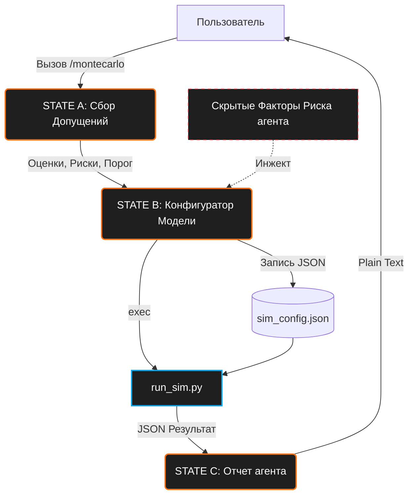
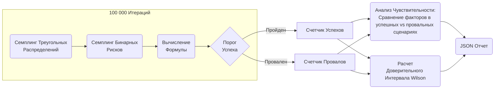

# Архитектура: montecarlo

Скилл `montecarlo` переводит бизнес-вопросы в симуляции методом Монте-Карло, выполняя 100 000 итераций для определения вероятности успеха и критических факторов риска.

## Схема потока данных

## Ядро Симуляции (`run_sim.py`)

Python скрипт представляет собой движок Монте-Карло, работающий без сторонних зависимостей (zero-dependency).

### Статистическая Модель
- **Треугольное Распределение**: Все непрерывные переменные используют треугольное распределение (`min`, `mode`, `max`).
- **Разброс Уверенности (Confidence Spread)**: Множитель уверенности динамически корректирует ширину распределения. Низкая уверенность расширяет границы `min` и `max`.
- **Бинарные Риски**: Риски рассматриваются как бинарные события с заданной вероятностью (`prob`). Если риск срабатывает, его влияние (`impact`) добавляется к итоговому результату или умножается на него (`multiplier`).
- **Вычисление Формулы**: Базовое математическое отношение между переменными и рисками задается строкой `formula`, которая безопасно вычисляется через `compile` в Python.
- **Доверительный Интервал Уилсона (Wilson Score Interval)**: 95% доверительный интервал для вероятности успеха рассчитывается с помощью метода Уилсона, обеспечивая надежные оценки даже для экстремальных вероятностей (близких к 0% или 100%).

### Анализ Чувствительности
Движок вычисляет среднее значение каждого фактора в успешных итерациях по сравнению с провальными. Если разница статистически значима, фактор помечается как "критический" (т.е. именно он "сломал план" или "привел к успеху").

## Компоненты

- **SKILL.md**: Машина состояний и правила промпта для агента.
- **scripts/run_sim.py**: Движок выполнения Монте-Карло.
- **scripts/sim_config.json**: Файл состояния, представляющий текущую статистическую модель.
